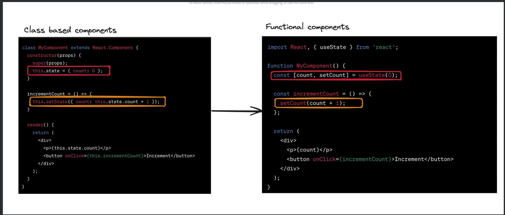

1 - What are hooks
What are hooks
Hooks are a feature introduced in React 16.8 that allow you to use state and other React features without writing a class. They are functions that let you "hook into" React state and lifecycle features from function components.

State



Functional:

```JS
import React, { useState } from 'react';

function MyComponent() {
  const [count, setCount] = useState(0);

  const incrementCount = () => {
    setCount(count + 1);
  };

  return (
    <div>
      <p>{count}</p>
      <button onClick={incrementCount}>Increment</button>
    </div>
  );
}
```

Class Based:

```JS
class MyComponent extends React.Component {
  constructor(props) {
    super(props);
    this.state = { count: 0 };
  }

  incrementCount = () => {
    this.setState({ count: this.state.count + 1 });
  }

  render() {
    return (
      <div>
        <p>{this.state.count}</p>
        <button onClick={this.incrementCount}>Increment</button>
      </div>
    );
  }
}
```

Lifecycle events


Functional:

```JS
import React, { useState, useEffect } from 'react';

function MyComponent() {
  useEffect(() => {
    // Perform setup or data fetching here

    return () => {
      // Cleanup code (similar to componentWillUnmount)
    };
  }, []);

  // Render UI
}
```

Class based

```JS
class MyComponent extends React.Component {
  componentDidMount() {
    // Perform setup or data fetching here
  }

  componentWillUnmount() {
    // Clean up (e.g., remove event listeners or cancel subscriptions)
  }

  render() {
    // Render UI
  }
}
```

Until now we’re seen some commonly used hooks in React-

1. useState
2. useEffect
3. useMemo
4. useCallback
   These hooks are provided to you by the React library.

2 - What are custom hooks
Hooks that you create yourself, so other people can use them are called custom hooks.
A custom hook is effectively a function, but with the following properties -
Uses another hook internally (useState, useEffect, another custom hook)
Starts with use

A few good examples of this can be
Data fetching hooks
Browser functionality related hooks - useOnlineStatus , useWindowSize, useMousePosition
Performance/Timer based - useInterval, useDebounce
